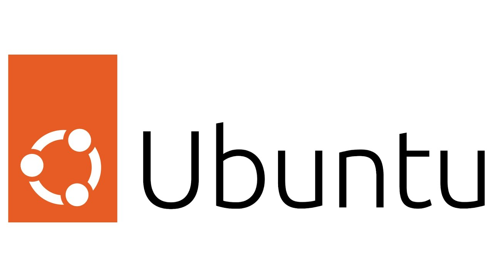
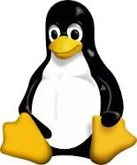

# What is Virtualization?
It is defined as the simulation of a virtual machine within a physical machine. An entire Operating System can be replicated by using virtualization. For instance, one can virtualize a computer with a Linux Operating System inside a physical computer with a Windows OS. One benefit of virtualization is that it can run multiple OS in a single machine. Moreover, virtualization is divided in two categories.

## Types of Virtualization
* Server-side virtualization: It is an expensive virtualization that uses physical server. Machines that want to do virtualization need to connect to this server via the network.
* Client-side virtualization: A software has to be installed in the physical machine to use this type of virtualization.
# Virtualbox
It is a open source software that can be installed in almost any computer. In addition, Virtualbox can run WIndows, Linux, Macintosh, and Solaris. To run this software, computers should meet the following minimal specifications:
* AMD V or INTEL V compatible processor
* Dual core x64 processor with 1.3 GHz or faster
* 4GB of RAM

# Installing Ubuntu
  1. The virtual machine is named, and the type and version of OS is chosen.
  2. The memory size is chosen from at least 2GB. If you have more than 8GB, you can increase de RAM.
  3. The next step is to create virtual hard disk, which has to be placed in a folder within our physical computer.
  4. Then, we go to Virtualbox settings. First, we go to general-advanced settings and mark bidirectional in both the Share Clipboard and Dragn'nDrop section. 
  5. Second, we go the System-Motherboard settings. Inside this section, we choose the amount of ram we want to use, and we mark the optical, hard disk. enable I/O APIC, and Hardware Clock in UTC Time.
  6. Furthermore, we put the processor in 2 and do not mark the PAE/NX and Nested VT-x/AMD-V section in the System-Processor.
  7. Also, we set the size of the memory in the Display setting and Monitor count.
  8. Finally, in Storage setting we choose out Ubuntu controller. 

# Updating Ubuntu
There are two ways of updating Ubuntu, which are by using Ubuntu Software Update or the command line.
The command is: sudo apt update; sudo apt upgrade -y; sudo apt full-upgrade -y
# Installing software
Software can be installed trough the Ubuntu software center. For example, VS Code was installed trough there. Also, we can install software with commands, such as sudo apt install flameshot vlc deluge geany tilix -y.

# Basic Linux commands
There are many Linux commands, but some of the most basics commands are:
* pwd:To in which directory you are in.
* ls: To see all files in a directory.
* cd: To go to a directory
* mkdir & rmdir: To create or remove a directory.
* rm: To delete files and directories.
* touch: To create file.
* 

# References 
* Linux Fundamentals. [Reference page](https://cis106.com/)