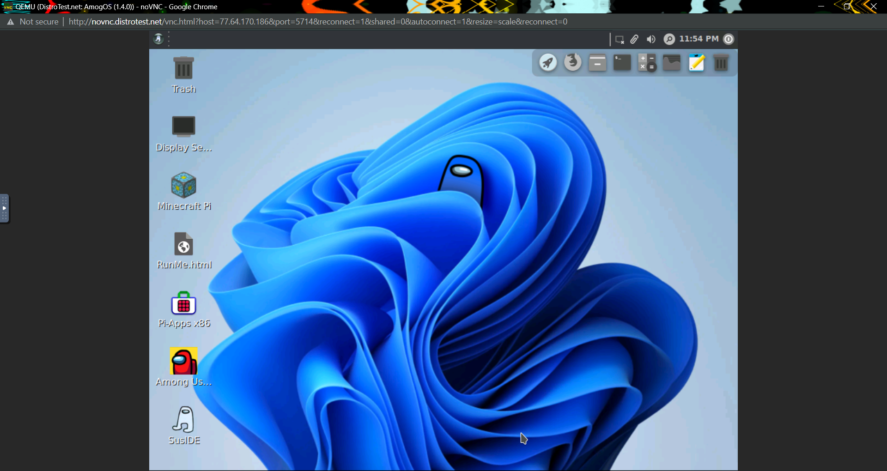

# Lab 1 Exploring Linux Distribution

## Question 1
1. What is the OS Type:
It is Linux.

2. Which major distro is it based on?
It is based on Debian

3.  Which processor architecture does it support?
It supports armhf, ppc64el, riscv, s390x, and x86_64.

4. Is the distribution active or is it discontinued?
It is active.

5. What is the distro’s home page?
The home page is https://www.ubuntu.com/

## Question 2
1. What is the name of the distribution and the OS Type:
The name of the distribution is Parrot, and the OS type is Linux.

2. Which major distro is it based on?
It is based on Debian.

3. Which processor architecture does it support?
It supports x86_64.

4. Is the distribution active or is it discontinued?
It is active.

5. What is the distro’s home page?
The distro's home page is https://www.parrotlinux.org/.

## Question 3
1. What is the name of the distribution?
Its name is Manjaro Linux.

2. What is the country of Origin?
It is originally from Austria, France, and Germany.

3. What major distribution is it based on?
It is based on Arch.

4. What is the distribution category?
THe category is Desktop, Live Medium, and Raspberry Pi.

5. Which processor architecture, aside from the one in the original query, does the OS support?
It supports aarch64 and x86_64.

## Question 4
### A Linux distribution used for Data Rescue/Data recovery
| Distro Name| Website| Desktop Environment|
|------------|--------|-------------------|
|Kali Linux  |http://www.kali.org/|Enlightenment, GNOME, KDE Plasma, LXDE, MATE, Xfce|

### A Linux distribution used for Education that supports the ix86 processor architecture.
| Distro Name| Website| Desktop Environment|
|------------|--------|-------------------|
| NixOS  |http://nixos.org/|Awesome, Enlightenment, Fluxbox, GNOME, i3, IceWM, KDE, Plasma, Ratpoison, Xfce|

### A Linux distribution that supports the OEM installation method
| Distro Name| Website| Desktop Environment|
|------------|--------|-------------------|
|Linux Mint|https://linuxmint.com/|Cinnamon, MATE, Xfce|

## Question 5
I selected the distribution named ChimeraOS. It is based on Arch Linux, and it is an operating system that provides gaming experience. If one is a a gamer, the page says that this OS is recommend. However, it is recommend to gamers that do not have a Gaming PC because this OS automatically puts games at the minimum. This means that is not recommend to people that wants to play their games at 100%.

## Question 6

