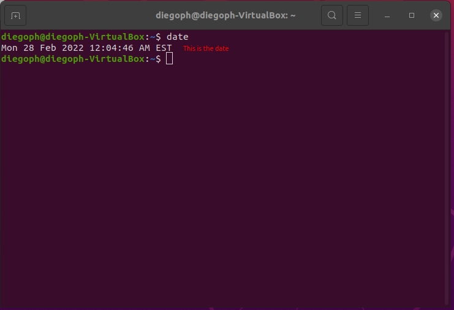
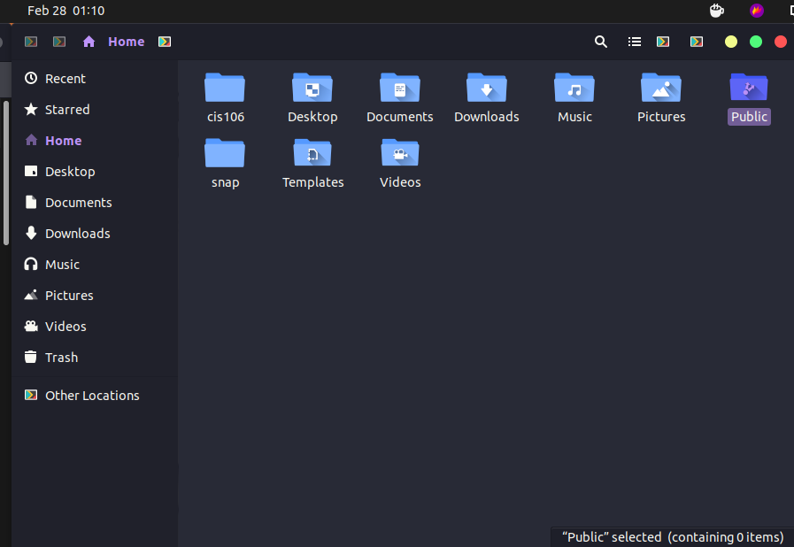
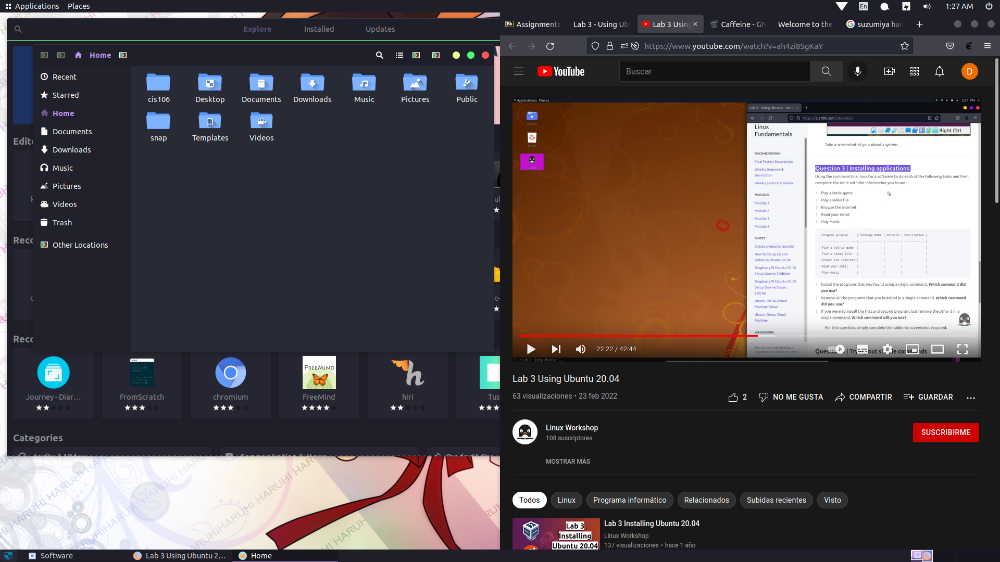

---
 Name: Diego Pajares Herrera
 Class: CIS 106
 Semester: Spring 22
 ---

 # Lab 3 Using Ubuntu

 # Question 1
 

 # Question 2
 

 # Question 3

 | Program purpose     | Package Name | Version | Description |
| ------------------- | ------------ | ------- | ----------- |
| Play a tetris game  | quadrapassel|1:3.36.0-1|popular Russian game, similar to Tetris|
| Play a video file   |smtube|18.3.0-1build1| YouTube videos browser
|
| Browse the internet |othman|0.6.0-2|electronic Quran browser|
| Read your email     |thunderbird|1:91.5.0+build1-0ubuntu0.20.04.1|Email, RSS and newsgroup client with integrated spam filter|
| Play music          |xmms2-plugin-mp4| 0.8+dfsg-18.2ubuntu3| XMMS2 - MPEG-4 plug-in|

## Questions 
1. Install the programs that you found using a single command. Which command did you use?
The command is sudo apt install quadrapassel smtube othman thunderbird xmms2-plugin-mp4

2. Remove all the programs that you installed in a single command. Which command did you use?
The command is sudo apt remove quadrapassel smtube othman thunderbird xmms2-plugin-mp4

3. If you were to install the first and second program, but remove the other 3 in a single command, Which command will you use?
The command is sudo apt install quadrapassel smtube $ remove othman thunderbird xmms2-plugin-mp4

# Question 4
| command | what it does |
|---------|--------------|
| echo    | It creates any word you want to type in|
| fortune | It will create random quotes      |
| cowsay  | It will create a text cow  |
| lolcat  | It will make the letters colorful |
| figlet  |  It will create a any word you want made of text characters   |
| toilet  |  It will make a border to the word that you want  |
| rig     | It will create a shipping address text|
