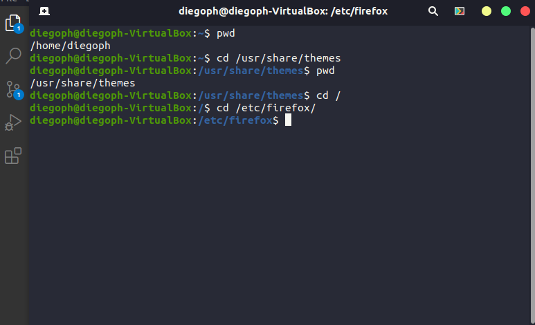
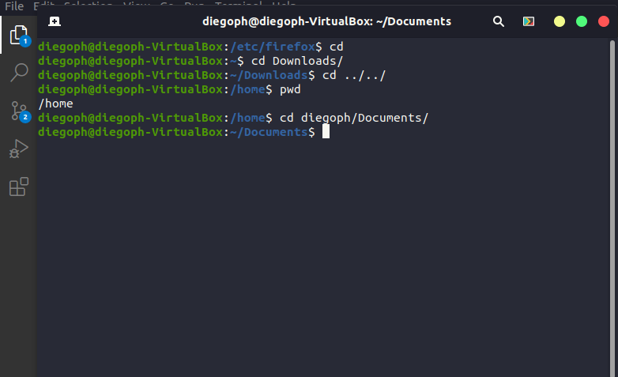
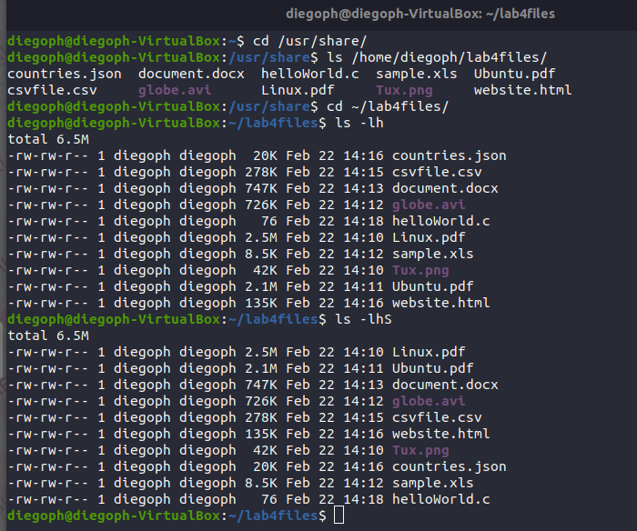
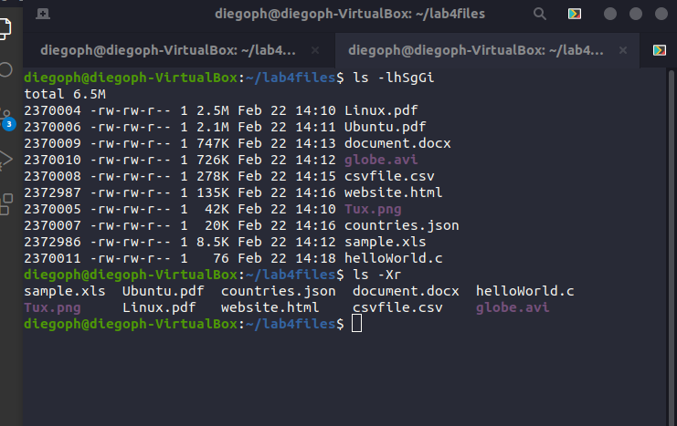
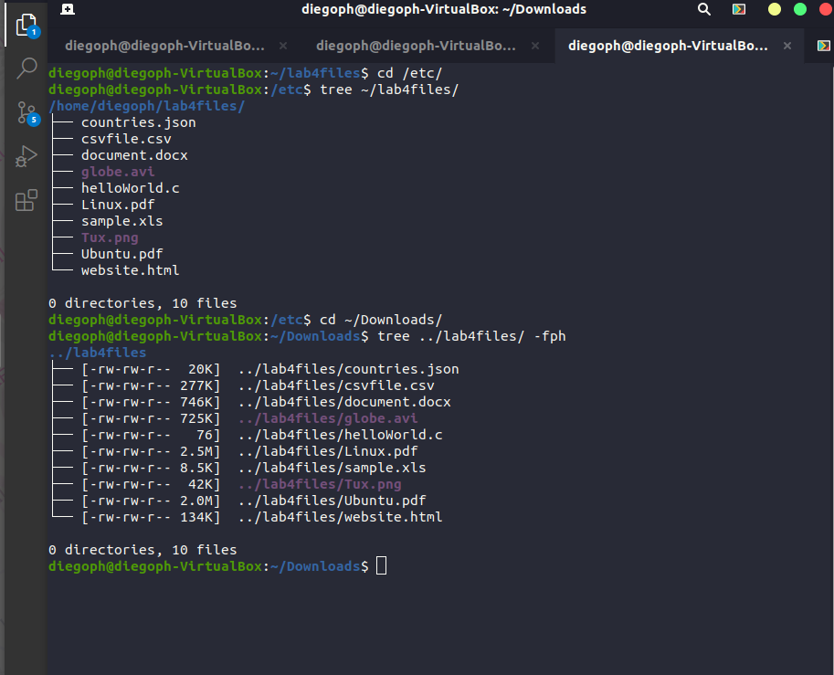
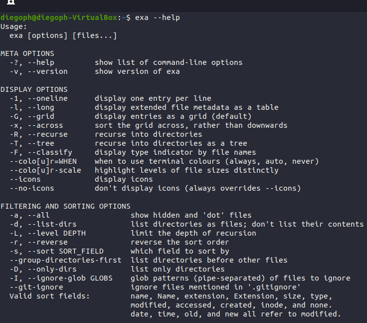
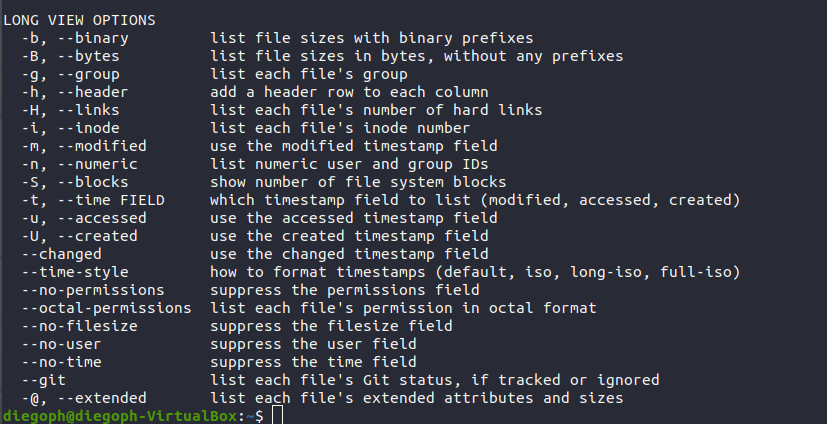
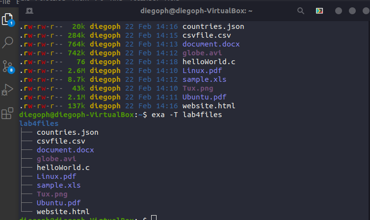
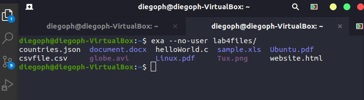

---
 Name: Diego Pajares Herrera
 Class: CIS 106
 Semester: Spring 22
 ---

# Lab 4 The Linux Filesystem

## Question 1

|Directory| Function  |
|---------|-----------|
|bin| Essential commands|
|dev| Device files|
|etc| System configuration files|
|home| User home directories|
|media| MOunt point removable media, such as DVDs and floppy disks|
|opt| Add-on software packages|
|proc| Kernel information, process control, system hardware information|
|srv| Information relating to services that run on the system|
|usr| Software not essential for system operation, such as applications|
|var| Dedicated to variable data, such as logs, databases, websites, and temporary spool (e-mail etc.) files that persist from one boot to the next|

| Command| WHat it does| Syntax | Example|
|--------|-------------|--------|--------|
|pwd| Display the current working directory| pwd| pwd /home/diego (on the bottom)|
|cd| Changes the current working directory| cd + destination| cd /home/$USER/Documents|
|ls| Used for listing the content ag a given directory or the file/directory itself| ls + directory | ls -a ~/PIcture|

## Question 2

## Question 3

## Question 4

## Question 5

