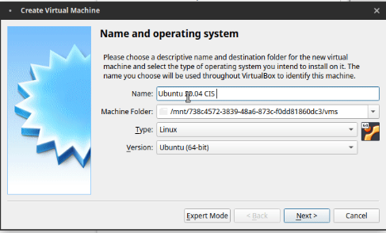
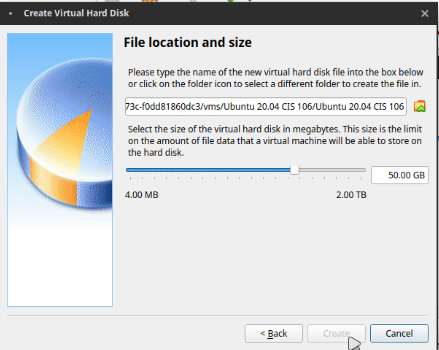
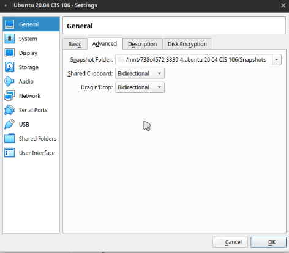
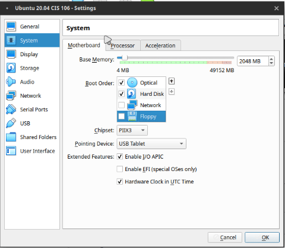
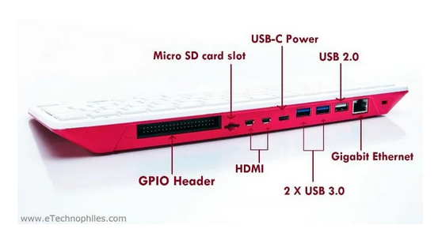

# Week Report 2

## Summary of Presentations 

### The basics of virtualization
Virtualization is the running of a virtual machine inside a physical machines. There are two types of virtual machine, which are server-side virtualization and client-side virtualization. A virtual machine is very useful if you want to test a new Operating System.

### Installing Ubuntu in Virtualbox

### What is the raspberry pi
Raspberry Pi is an affordable mini computer that can do everything a desktop computer can do.
There are different models of Raspberry Pi:
* Raspberry PI 4
* Raspberry PI 3
* Pi Zero W
* Pi 3 A+
* Raspberry Pi 400

Moreover, there are many projects you can do with a Raspberry Pi:
* Crypto Tracker
* Hydroponic Farm
* Smart Security Camera
* OpenCat
* A.I. Air Guitar