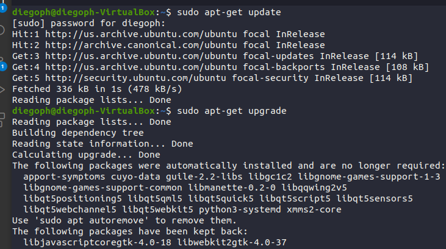

# Week Report 3

## Summary of Presentation 

### Exploring Desktop Environments
There are different desktops environments, such as:
* GNOME
* MATE
* Cinnamon
* Pantheon
* KDE
A graphical user interface or GUI allows the user to use the computer by using visual effect.
A desktop environment or DE is an default interface made of a bundle of programs.
Some elements of the desktop environment include:
* Display manager
* FIle Manager
* Icons
* Favorite bar
* Launcher

### The bash SHell
It is a program that let user access to the Linux system.
Some shells are:
* Tcsh Shell
* CSh SHhell
* KSh Shell
* Zsh Shell
* Fish Shell
Moreover, some bash shortcuts include the Ctrl + A, Ctrl+ E, Ctrl + K, etc.

### Managing Software 
1. Command for updating ubuntu: sudo apt update
2. Command for installing software: sudo apt install 'name of the program'
3. Command for removing software: sudo apt remove 'name of the program'
4. Command for searching for software: apt search 'name of the software'
5. Definition of the following terms: 
   * Package: A compressed file archive containing all of the files for an application.
   * Library: Collection of pieces of code.
   * Repository: A storage location that serves as the location of application and OS updates. 
6. 

